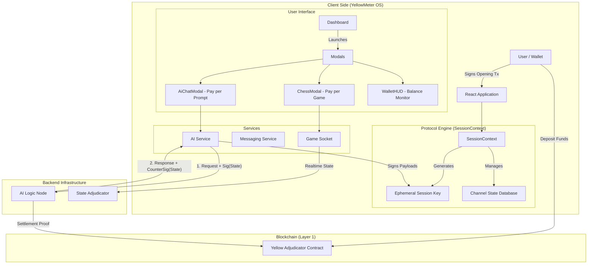

# YellowMeter OS - Technical Documentation

## 1. Project Overview

**YellowMeter OS** is a "Web3 Operating System" interface designed to demonstrate the capabilities of the **Yellow Network** protocol. It serves as a comprehensive dashboard that integrates high-frequency interaction applications (AI Chat, P2P Cloud Gaming, Messaging) using **State Channels** to eliminate gas fees for intermediate transactions.

The project showcases how cryptographic primitives can be used to create seamless, "Web2-like" user experiences while maintaining "Web3" security and non-custodial properties.

## 2. System Deployment & Architecture

We use bidirectional state channels to create a secure off-chain tunnel between the User (Client) and the OS (Server).

### 2.1 High-Level Component Diagram



### 2.2 The "State Channel" Engine Sequence

This sequence diagram illustrates the lifecycle of a user session, from the initial on-chain deposit to the high-frequency off-chain interactions.

```mermaid
sequenceDiagram
    participant U as User (Wallet)
    participant S as Session Key (Client)
    participant B as Backend (Yellow Node)
    participant C as Adjudicator (Chain)

    rect rgb(33, 33, 33)
        note right of U: Phase 1: Opening (Gas Required)
        U->>C: Deposit MockUSDC (100.0)
        C-->>U: Channel Created (ID: 0xCH_123)
        U->>S: Generate Ephemeral Key (viem) & Authorize
    end

    rect rgb(50, 40, 0)
        note right of U: Phase 2: Transacting (Zero Gas)
        loop High Frequency Actions
            note over U, B: Example: AI Query (Cost: 0.02 USDC)
            U->>S: Request Action (Prompt)
            S->>S: Update State (Nonce: N+1, Bal: 99.98)
            S->>S: Sign State (Sig_User)
            S->>B: Send Request + Sig_User
            B->>B: Validate Sig & Balance
            B->>B: Execute Logic (LLM Inference)
            B->>S: Return Result + Counter-Sign (Sig_Server)
            S->>U: Display Result (Confirmed)
        end
    end

    rect rgb(20, 20, 40)
        note right of U: Phase 3: Settlement (Gas Required)
        U->>C: Request Withdrawal
        B->>C: Submit Final Proof (Highest Nonce State)
        C->>U: Transfer Remaining Funds (99.98 USDC)
        C->>B: Transfer Earnings (0.02 USDC)
    end
```



## 3. Protocol Implementation Details

### 3.1 Data Structures
The core of the integration relies on the `ChannelState` structure. This ensures both parties agree on the financial state at any point in time.

```typescript
// Defined in src/services/ai.service.ts
export interface ChannelState {
  channelId: string;      // Unique Identifier derived from User Address
  nonce: number;          // Monotonically increasing counter to prevent replay attacks
  userAddress: string;    // The EOA (Externally Owned Account)
  serverAddress: string;  // The OS Backend Address
  userBalance: string;    // Current User Funds (in Wei/MicroUDSC)
  serverBalance: string;  // Current Server Enarnings (in Wei/MicroUSDC)
  signature: string;      // Cryptographic signature of the state
}
```

### 3.2 State Transition Logic
Every interaction (e.g., sending a chat message that costs money) follows this strict transition logic:

1.  **State Construction**:
    A deterministic string is created: `CHANNEL:{id}|NONCE:{n}|UBAL:{u}|SBAL:{s}`.
    *This format allows for simple verification without complex ABI encoding overhead.*

2.  **Signing**:
    The client uses `viem`'s `signMessage` with the **Session Key** (not the main wallet) to sign this string.
    > *Why Session Key?* To avoid popping up a MetaMask wallet signature request for every single chat message.

3.  **Verification**:
    The backend recovers the address from the signature. If it matches the authorized session key for that channel, the transaction is processed.

## 4. Core Modules & Components

### 4.1 Session Management (`src/context/SessionContext.tsx`)
This is the heart of the application's state channel implementation.
- **Function**: Manages the lifecycle of the user's "Off-chain Session".
- **Key Responsibilities**:
  - `openChannel(amount)`: Simulates the on-chain deposit and instantiates the local state.
  - `LocalAccount`: Uses `privateKeyToAccount` from `viem` to create a browser-only, secure signing key.
  - `logs`: Tracks every cryptographic operation (`addLog`) to show the user the "proof" of their actions.

### 4.2 AI Integration (`src/services/ai.service.ts` & `AiChatModal.tsx`)
Implements the "Pay-per-inference" model.
- **Protocol Logic**:
  - Manages the `requestInference` flow.
  - Checks if the channel is solvent (User Balance > Cost).
  - Handles the atomic swap of "Signed State" for "AI Intelligence".

### 4.3 P2P Gaming (`src/components/modals/ChessModal.tsx`)
A wager-based chess game implementation.
- **Function**: Allows users to play chess with cryptocurrency stakes.
- **Mechanism**:
  - **Socket.io**: Used for move propagation (e.g., `socket.emit('move', { from: 'e2', to: 'e4' })`).
  - **State Channels**: Used for the wager. Players lock funds at the start. The game result acts as the "Adjudicator" to decide who gets the locked funds.
  - **Yellow Branding**: Custom visual indicators for valid moves (Yellow) and captures (Red).

### 4.4 Secure Messaging (`src/services/messaging.service.ts`)
A decentralized messaging layer integrated with ENS.
- **Function**: Enables wallet-to-wallet communication.
- **ENS Integration**:
  - Utilizes `wagmi` hooks to resolve Ethereum addresses to readable ENS names.
  - Fetches and displays ENS avatars.
- **Architecture**:
  - Socket-based real-time delivery (`socket.io-client`).
  - Uses `signMessage` to authenticate the sender without paying gas.

## 5. Technical Stack

| Category | Technology | Purpose |
|----------|------------|---------|
| **Core Framework** | React 19 + Vite | Application logic and build system |
| **Styling** | Tailwind CSS | Rapid, utility-first styling with "Yellow" branding |
| **Web3 Primitives** | viem | Low-level cryptographic operations (Signing, Keys) |
| **Wallet Connection** | Wagmi / RainbowKit | Connecting user wallets (MetaMask, etc.) |
| **Real-time** | Socket.io Client | WebSocket connections for Games and Chat |
| **3D Rendering** | Three.js / R3F | Immersive background elements (`Background3D`) |
| **Animation** | Framer Motion / GSAP | Fluid UI transitions |

---
*Verified Documentation for YellowMeter OS Hackathon Project*
